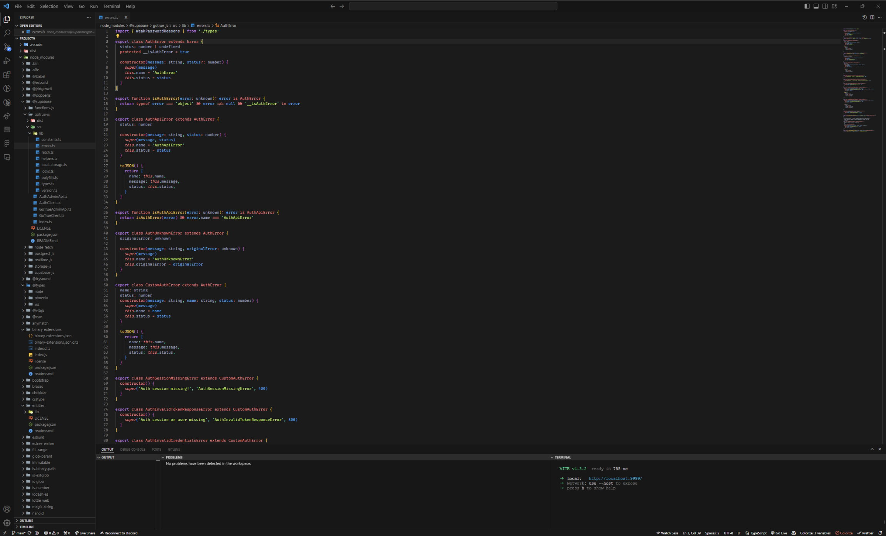

# Felina - Dark Theme

Felina is a customized dark theme for VS Code.

## Installation

1. Open VS Code.
2. Open the Extensions panel.
3. Search for "Felina - Dark Theme" in the extensions marketplace.
4. Once you find the theme, click on the "Install" button.
5. After installation is complete, click on the "Select Color Theme" button and choose Felina theme.

## Support

If you like this theme, you can support its development by buying me a coffee.

## License

This theme is licensed under the MIT License.

